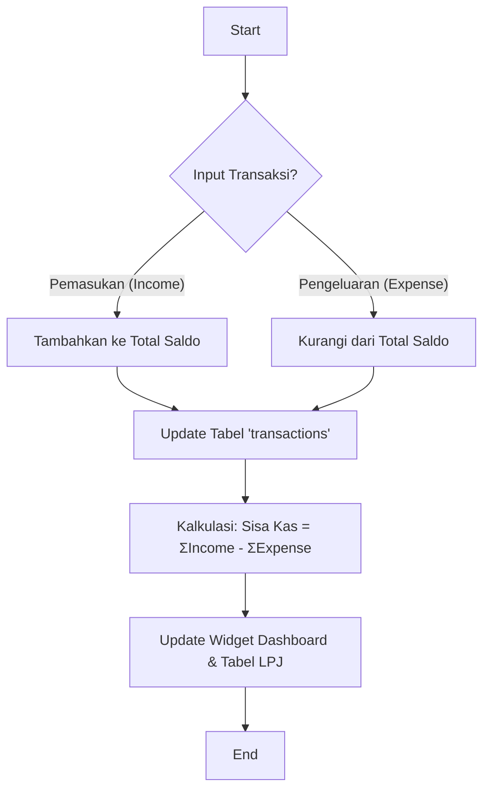

# Dokumentasi Teknis Aplikasi HUT IBI Kota Pekalongan

## 1. Arsitektur Database (Supabase)
Skema database dirancang untuk integritas data antara perencanaan (RKA) dan realisasi. Gunakan file [DATABASE_SCHEMA.sql](DATABASE_SCHEMA.sql) untuk inisialisasi tabel di Supabase.

## 2. Logika Sisa Kas (Flowchart)
Sisa Kas dihitung secara real-time berdasarkan total transaksi masuk dikurangi total transaksi keluar.



## 3. Desain Navigasi (Mobile-First)
Navigasi menggunakan **Bottom Navigation Bar** untuk kemudahan akses satu jempol (one-handed use).
- **Home**: Dashboard kegiatan terkini.
- **Kegiatan**: Manajemen timeline & kepanitiaan.
- **Keuangan**: Monitor RKA vs Realisasi.
- **Laporan**: Akses dokumen LPJ digital.

## 4. Struktur Folder (Next.js 15)
```text
src/
├── app/
│   ├── layout.tsx         # Global Layout & BottomNav
│   ├── page.tsx           # Beranda (Dashboard)
│   ├── keuangan/
│   │   └── page.tsx       # Finance Dashboard
│   ├── kegiatan/          # Event Management (Soon)
│   └── laporan/           # Reporting (Soon)
├── components/
│   ├── BottomNav.tsx      # Sidebar/Mobile Navigation
│   └── ui/
│       └── Card.tsx       # MD3 Styled Cards
└── lib/                   # Supabase client config
```

---
*Dikembangkan secara eksklusif untuk IBI Kota Pekalongan.*
